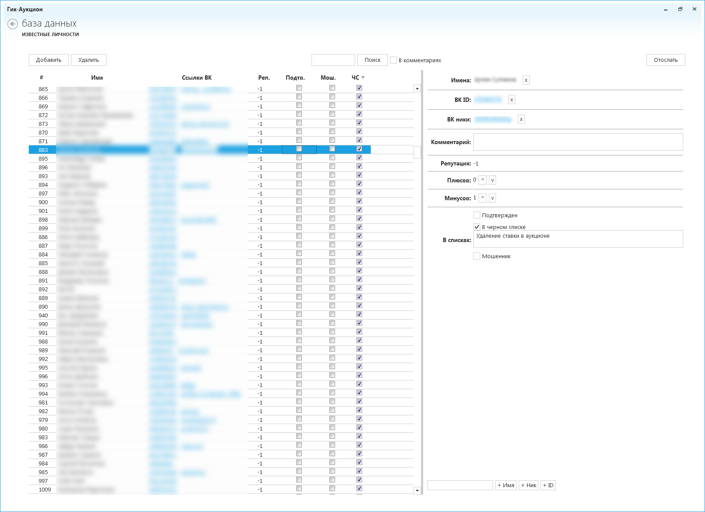

# GeekAuction

GeekAuction management console

# Database Editor

Редактор базы данных продавцов позволяет вносить изменения в удаленную базу данных.

Редактор использует `git` для загрузки базы и публикации изменений.

## Настройка

Конфигурационный файл `config.json` позволяет настроить расположение git-репозитория с базой данных и файл базы данных.

**Важно** В файле следует указать правильное расположение **корня установки** `git`.
